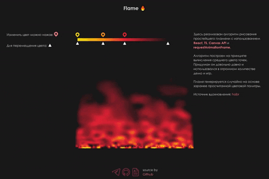

# Анимация пламени 🔥 и динамический градиент
---

---
## [<a href="https://knyazev13ivan.github.io/flame-animation-with-gradient/">**Live Demo**</a>]

---
#### Это реализация **алгоритма рисования простейшего пламению**. Алгоритм построен на принципе вычисления среднего цвета точек. Придуман он довольно давно и использовался в огромном количестве демо и игр. Пламя генерируется случайно на основе заранее просчитанной цветовой палитры.
---
Источник вдохновления: <a href="https://habr.com/ru/post/656541/">habr</a>